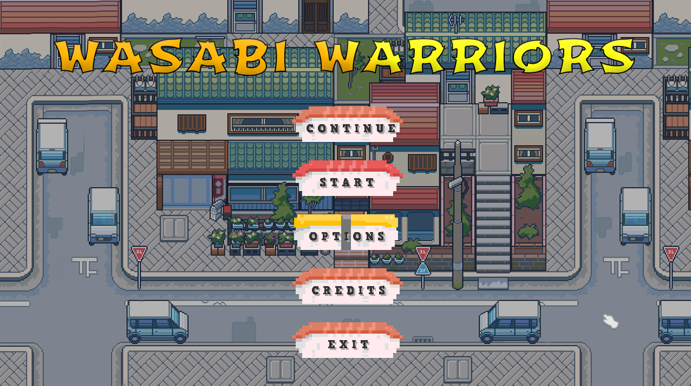

# Wasabi Warriors RPG

Wasabi Warriors is a Role-Playing Game with a theme-based on an urban Japanese environment and a story about power and corruption. It is mainly played in top-down perspective combined with combat scenes and has different locations and areas to explore. The project aims to be a 30 minutes gameplay experience with a catching narrative to make the player experience a different journey.

  

## Synopsis
Kenzo, a young man with passion for cooking, is very thankful to his mentor, Erika, since she gave him the oportunity to work in her very famous restaurant and become her apprentice and heir. 
He lives a happy normal life until one day he finds out his mentor has been found dead in suspicious curcumstances and the secret recipe that makes her restaurants special has been stolen.
Kenzo will have to go on a journey to protect his mentor's legacy and avenge her.

## Key Features

 - Japanese theme: The story of our characters is developed in an urban environment in Japan, focused in the region of Otaru. Otaru is known for its prosperous cities and work opportunities, but inequality among people is always present; suburbs and worker districts are all around each city.

 - Randomly generated battles: While the character walks and explores the city, they may have to face some imminent enemies and threats. Although there will be some already predefined battles to build the storyline, there will also take place other extra fights to gain resources and prepare yourself to fight the actual bosses. They will appear randomly but with some conditioning factors such as distance traveled or time passed. To make sure that it is not a nuisance or entanglement to continue the with game.

 - Party members management: There will take place 4 different party members, each one with their own character, abilities and appearance. The player will be allowed to change them at any moment during the gameplay, due to the fact that some actions will only be allowed with an specific party member. The battle will also be based on the party members, attacking and defending themselves, each turn a different one.

 - Turn-based Combat: the player will face different enemies in battles developed in turns, each player or enemy teams will have one opportunity to attack or defend per turn.

 - Exploration: the player should investigate into each area and dungeon to search for special and unique objects in order to advance in the story.

 - Quests & Progression: the player will have different challenges to complete in order to upgrade different items. The main quests are about collecting the keys mentioned in the storyline and reward the player with a new party member.

 - Social Interaction: cooperation between party members and what other non-playable characters (NPC) explain is important to know the plot and identify the path to solve the main conflict of the game.
 
## Controls

| Action | Key | Button |
| :---: | :---: | :---: |
| **Move Up** |  |  |
| **Move Down** |  |  |
| **Move Left** |  |  |
| **Move Right** |  |  |
| **Select / Interact** |  |  |
| **Open Map** |  |  |
| **Return / Cancel** |  |  |
| **Change between party members** |   |   |
| **Pause Menu** |  |  |

## Developers

 - [Alejandro Ávila](https://github.com/Omicrxn) - Programmer and Project Manager
 - [Ali Hassan](https://github.com/FeroXx07) - Programmer and UI Designer
 - [Bosco Barber](https://github.com/boscobarberesbert) - Programmer and UI Designer
 - [Carles López](https://github.com/carlesli) - Art Director and Game Designer
 - [Maria Calle](https://github.com/mav006) - Narrative Director and Game Designer
 - [Yeray Tarifa](https://github.com/yeraytm) - Programmer and Game Designer

## License

This project is licensed under an unmodified MIT license, which is an OSI-certified license that allows static linking with closed source software. Check [LICENSE](LICENSE) for further details.

# About Bat Cat Studios
Bat Cat Studios is a game development team based in Barcelona which team members are students of the UPC/CITM Videogame Design and development bachelor degree. Wasabi Warriors RPG is the first game developed by Bat Cat triggered by Project II subject. Our objective is to create games that feel different to the player but maintaining the common mechanics.

